# Awesome_Group
Project 1 
Group members:
Satoru
Hao
Toby

## FINAL VERSIONS OF FILES:
>
Backtesting_With_Python_Final_Complete.ppxt
>
project_1_dashboard_final_3.ipynb

# Backtesting with Python 

At the end of the day, investors and traders are here to make money. Whether you're on social media, talking to friends or to fund managers, people claim all the time that they can beat the market. 
Our goal was to find out whether we could optimise our profits in a way that was considerably better than just buying and holding those assets over the same period. 

We did this by selecting three popular and well documented trading strategies and using backtesting with financial data in order to compare them against one another, find whether one is more superior than the others, or whether one strategy works best for one stock compared to another.

We decided to focus on the period of time before, during and after the Global Financial Crisis of 2008, to work out whther these strategies could have been implemented to either limit losses, or to profit from the crash itself. At the end of our research period, we would compare our results.

To find this out, used pandas datareader to grab historic data from Yahoo finance for 3 stocks from different industries; We chose Apple, Ford and Bank of America. 

Luckily this data was already clean and other than removing NANs from the dataframes after calculating averages, we didn't have to do much else.

The three key strategies we decided to use were simple moving averages, relative strength index, and the moving average convergence divergence.

## Quick Overview of our Strategies

### SMA:
Simple moving average uses constantly updated average price data over a chosed period and then making trades based on when these moving averages cross one another on a chart. We used the 20 day MA and the 50 day MA, a made a buy signal when the 20 moves above the 50 day, and a sell signal when the 20 day moves below the 50 day.

Apple SMA
>
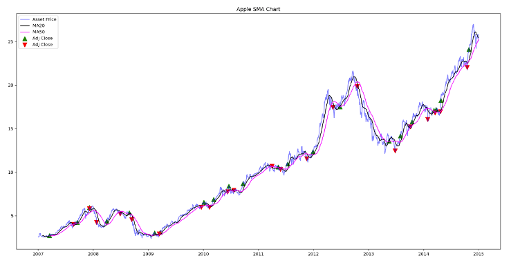

Ford SMA
>
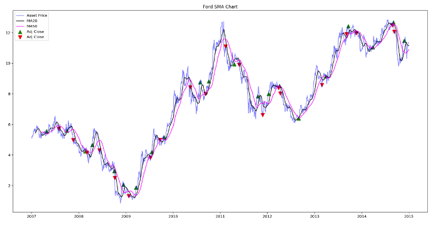

Bank of America SMA
>
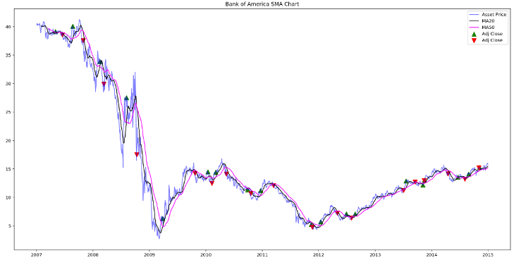

### MACD:
Moving average convergence divergence is a trend-following momentum indicator that shows the relationship between two moving averages of an asset's price. It's calculated by subtracting the 26-period exponential moving average (EMA) from the 12-periof EMA.
This calucatation, when plotted, gives us the MACD line. A 9 day EMA of the MACD is then plotted over the top of the MACD line. This "signal line" then functions as the buy or sell signal. The MACD line reacts to price movements faster than the signal line, so when the MACD crosses above it's signal line it can trigger a buy signal and when it crosses below, a sell signal. 

Apple MACD
>
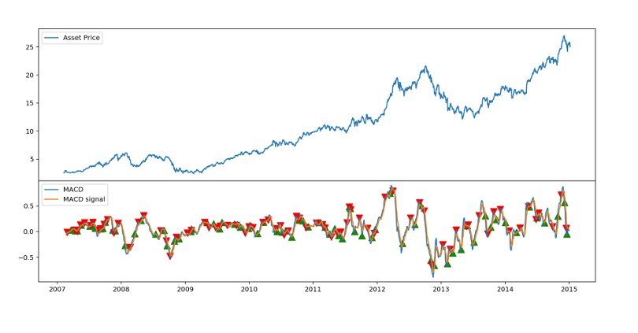

Ford MACD
>
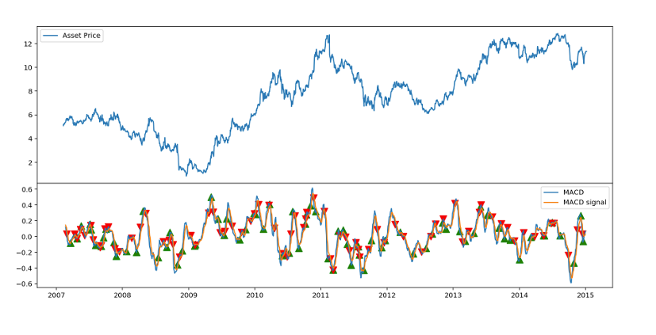

Bank of America
>
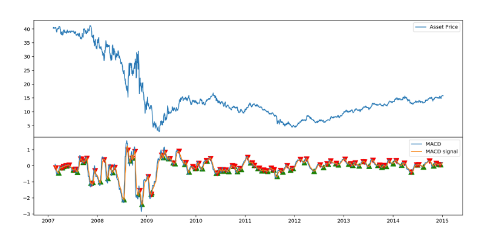

### RSI:
Relative strength index is an oscillating indicator designed to measure a stock's speed and size of price changes over a chosen time period. The average gains divided by average losses over chosen time period gives us the relative strength value. It's then plotted on a graph between 0 and 100. Many traders use this indiactor to determine if a stock is overbought, or oversold, indicating a trend reversal and therefore a buy or sell signal. For example, if a stock has risen rapidly in a short period of time and may reverse lower.

Apple RSI
>
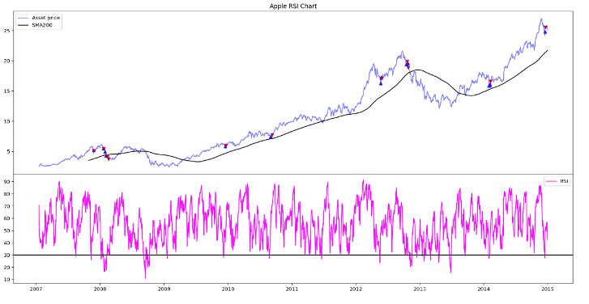

Ford RSI
>
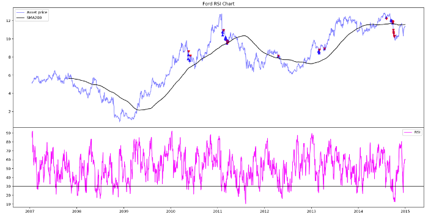

Bank of America RSI
>
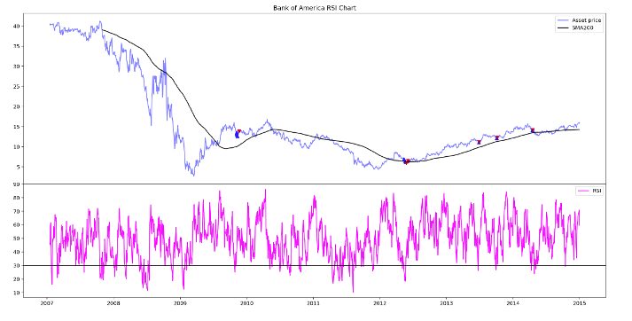

## Summary and Comparison

Comparing all stocks and strategies, the best decision would have been to buy and hold Apple stock for the entire period. Buying and holding Bank of America on the other hand would have given the opposite result. 

Of the active strategies we used, the MACD was shown to be the most successful overall. This is not to say that another combination of moving average periods wouldn't be more successful, but in our comparison this is the result.

We note the success of SMA with Bank of America. Although the company never fully recovered from the full during 2008, it would have sold in September 2008, then bought on the reversal of the trend. 

Taking into account the tax implications of trading frequently, and the returns we charted, we believe the best strategy is to buy and hold, unless something changes within the business negatively.

### Strategy Returns

Apple Returns
>
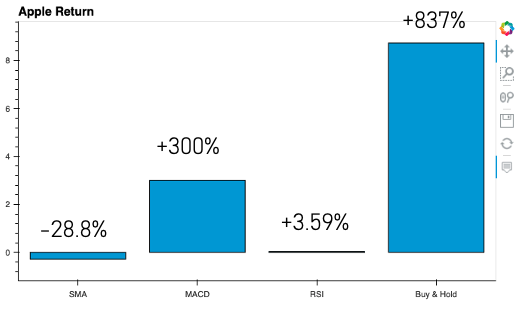

Ford Returns
>
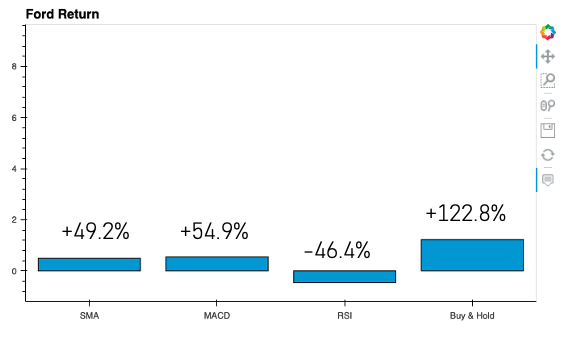

Bank of America Returns
>
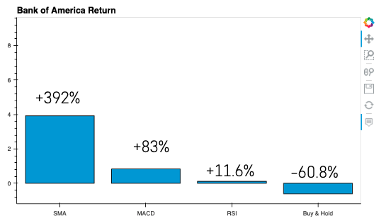

### Comparing Win Rates of Strategies

Apple Win Rate
>
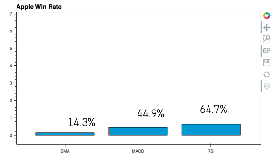

Ford Win Rate
>
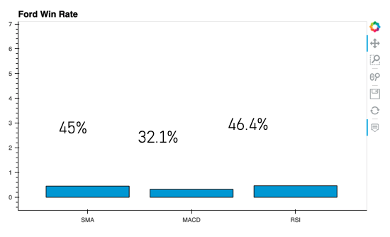

Bank of America Win Rate
>
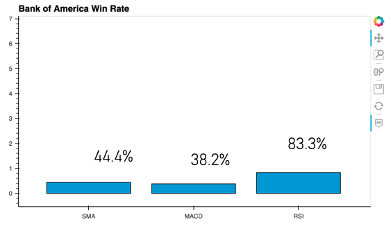

## Challenges Faced

We had a few problems with Github; sometimes it would seem to work seamlessly and other times the same thing we had been doing would suddenly not work or do something different. We created a spare repo in order to practice, which helped, but we still had some issues which wasted some time.

Had some issues with the scale of bar charts in the dashboard.

We decided not to use a comprehensive, existing back testing library that we found in favour of writing more of the code ourselves, which took more time initially and more time in adding and editing in a collaberative way.

Being in different time zones also presented a challenge, but not too much of a big deal.

## If we had another two weeks?

If we had more time, we would have back tested more stocks, included cryptocurrencies and other assets. We would have compared the differences between these using the strategies we tested.

We would have made our charts more visually stimulating with more interaction and 3D visualisation.

We would have drawn data directly (scrapings).

### Libraries required
TA-Lib
TA
Pandas
Pandas_Datareader
Numpy
Matplotlib
Panel

